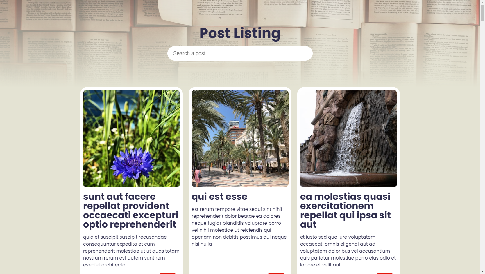
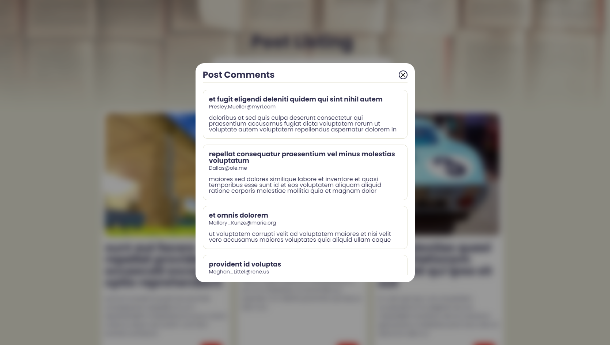

# Week 2

##### Assignment Author: Mustafa Emre TUFAN

##### See Live [Here](https://week-2-emretfn.netlify.app/)

## 📑 Assingment

👉 Sayfa açıldığında "https://jsonplaceholder.typicode.com/posts" api'sine istek atıp verileri sayfada gösteriyorsunuz.  
👉 Sayfanın üst kısmında bir header olacak ve bu header içerisinde bir tane search filtresi olacak. Bu search gelen verideki "title" ve "body" içerisinde eşleşen postları göstericek. Boş olursa, tüm veri gelecek. 
👉 Her post card şeklinde gösterilecek ve bir delete butonu olacak. O butona tıklayınca o post silenecek. 
👉 Post'un üzerine tıklanırsa eğer o post id'si ile "https://jsonplaceholder.typicode.com/posts/$%7BpostId%7D/comments" istek atıp, çıkan sonucu modal içerisinde göstericek. 
👉 Css önemli, flex veya grid kullanıp responsive tasarlamanızı istiyorum. Ekran küçüldüğünde de sorunsuz bir görüntü olmalı. 

**Ekstralar:** Silerken bir confirm modalı çıkarsa güzel olur. Ayrıca kendini denemek isteyen arkadaşlar, search kısmına debounce koyabilir.

## 💻 Code Structure

The codebase is structured as follows:

👉 `index.html`: This is the main HTML file that includes the structure of the web page. 
👉 `index.js`: This JavaScript file includes the main functionality of the application. 
👉 `style.css`: This file includes all the styles used in the application. 
👉 `reset.css`: This file resets the default styles of the browser to avoid inconsistencies. 

## ⚙️ Installation and Setup

To set up and run the project locally, follow these steps:

1. Clone the repository to your local machine.
2. Open the `index.html` file in your browser.

## 🔮 Future Improvements

👉 Improve the UI/UX of the application. 
👉 Add more features like editing and updating the posts. 
👉 Improve error handling. 
